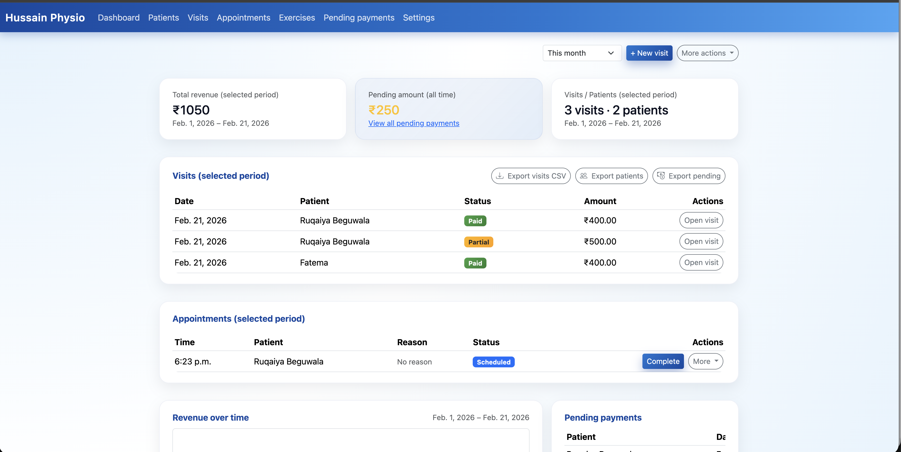

Hussain Physio – Clinic Management App
======================================


Overview
--------

Hussain Physio is a small clinic management web app built with Django. It helps you manage patients, visits, payments, appointments, exercises and basic reporting for a single physiotherapy clinic.

This README focuses on the **features** that are currently implemented in the app.


Tech Stack
----------

- Backend: Django 5
- Database: SQLite (default Django configuration)
- UI: Bootstrap 5 with simple custom styling


Core Concepts
-------------

- **Patient** – a person receiving treatment at the clinic.
- **Visit** – a treatment session for a patient, with fee and payment details.
- **Appointment** – scheduled visit in the calendar.
- **Exercise** – rehab exercise content (linked from Google Drive).
- **Pending payments** – visits with outstanding dues.
- **Clinic settings** – clinic name, owner email, default visit fee, etc.


Features by Area
----------------

### Dashboard

Home page of the app.

- **Date range filter**
  - Switch between Today, This week, This month, This year.
  - Changing the filter automatically reloads the dashboard.
- **Summary cards**
  - Total revenue in the selected period.
  - Pending amount (all time).
  - Visit and patient counts for the selected period.
- **Recent visits table**
  - Shows visits for the selected period (respects the dashboard date filter).
  - Displays patient, status and amount with quick link to open the visit.
- **Appointments table**
  - Shows appointments in the selected period.
  - Quick actions to mark appointments as completed or edit/delete them.
- **Pending payments snippet**
  - Shows a small list of recent pending dues with patient, date and amount.
- **Quick actions**
  - Create new visit, new patient, new appointment from the header.
- **Exports**
  - Export visits CSV for the selected date range.
  - Export all patients.
  - Export pending dues (all time).


### Patients

- **Patients list**
  - Search by patient name or mobile number.
  - Shows:
    - Name
    - Mobile
    - Last visit date
    - Total revenue
    - Pending amount
  - Link to open patient detail page.
  - Export all patients to CSV.
- **Patient detail**
  - Shows patient demographics and notes.
  - Displays all visits for that patient, ordered by date.
  - Quick navigation to visit detail.
- **Create / edit patient**
  - Simple form for basic fields (name, phone, email, age, gender, address, notes).


### Visits

- **Visits list**
  - Full list of visits with powerful filters:
    - Date range: Today / This week / This month / This year / All time.
    - Payment status: All / Pending / Partial / Paid.
    - Sort: newest/oldest first, highest/lowest due.
    - Search by patient name or phone.
  - Filters auto-apply on change (no extra Apply button).
  - Displays for each visit:
    - Date
    - Patient (clickable to patient detail)
    - Fee, amount paid and due
    - Payment status badge (Paid, Partial, Pending)
  - Actions per visit:
    - View visit
    - Edit visit
    - Clear due (modal to record a payment and keep you on the same page)
    - Delete visit (with confirmation modal)
  - Export filtered visits to CSV (respects current range, status, sort and search).

- **Visit creation / editing**
  - Select patient (or start from a patient / appointment).
  - Fields for date, symptoms, treatment, fee, amount paid, payment method, payment date, notes, next appointment date.
  - Automatically computes payment status (paid / partial / pending).
  - Option to clear previous dues while creating a visit:
    - Lists patient’s older unpaid visits.
    - Apply a lump-sum “clear amount” across previous visits.
  - Automatically updates patient summary fields (first visit, last visit, totals).

- **Visit detail**
  - Shows full visit information and payment status.
  - Shows patient details.
  - Dues and balances clearly indicated.
  - Exercises for this visit shown in a collapsible section (see Exercises below).


### Pending Payments

- Dedicated **Pending payments** page.
- Lists all visits with outstanding dues (non-paid visits).
- Columns:
  - Visit date
  - Patient and phone
  - Fee, amount paid, due
  - Payment status
  - Actions (open visit, clear due etc.)
- Filters:
  - Age of dues: All / Older than 7 / 30 / 90 days.
  - Filter auto-applies on change.
- Summary:
  - Total pending amount for the current filter.
  - Shows the “as of today” date.
- Export:
  - Export the currently filtered pending payments to CSV.


### Appointments

- **Appointments list**
  - Groups appointments into:
    - Today’s appointments
    - Upcoming appointments
    - Past appointments
  - Shows date, time, patient, reason and status.
  - Quick actions:
    - Mark appointment as completed.
    - Edit or delete appointment.
- **Create / edit appointment**
  - Select patient.
  - Set scheduled date/time, reason and notes.
- **Visit integration**
  - From appointments you can complete and move into a visit flow.


### Exercises and Rehab Content

- **Exercise library**
  - List of exercises with name, category and basic description.
  - Backed by the Exercise model with Google Drive file metadata:
    - `google_drive_file_id`
    - `file_name`
    - `mime_type`
    - `thumbnail_url`
- **Exercise create form**
  - Form fields for name, description, category.
  - Hidden fields used for Google Drive integration (file id, file name, mime type, thumbnail).
- **Exercise detail**
  - Shows the exercise details.
  - Embeds or links out to the underlying Drive media.

- **Exercises per visit**
  - On the visit form you can attach multiple exercises to a visit using a multi-select / chip-like UI.
  - On visit detail, exercises are shown in an accordion (collapsible) section with media previews.
  - Intended for sharing instructions with patients (e.g. via WhatsApp message).


### Settings

- **Settings page**
  - Form for:
    - Clinic name
    - Owner name
    - Owner email
    - Default visit fee
  - Used across the app (for display and for sending monthly report emails).


### CSV Exports

- **Patients CSV**
  - URL: `/patients/export/`
  - Includes:
    - Patient ID, name, mobile, email, age, gender, address.
    - First and last visit dates.
    - Total revenue and total pending.

- **Visits CSV**
  - URL: `/visits/export/`
  - Respects current visits list filters:
    - Date range.
    - Payment status.
    - Sort.
    - Search.
  - Includes:
    - Visit ID, patient, mobile, visit date.
    - Visit fee, amount paid, due.
    - Payment status.

- **Pending payments CSV**
  - URL: `/pending-payments/export/`
  - Respects age filter (All / 7 / 30 / 90 days).
  - Includes the same columns as the pending payments table.


Monthly Report Email
--------------------

- Management command: `python manage.py send_monthly_report`
- Computes stats for the **previous calendar month**:
  - Period dates.
  - Total revenue received.
  - Number of visits.
  - Number of patients.
  - Pending dues (all time).
- Sends an email with:
  - Plain-text summary.
  - HTML table summary.
- Recipient:
  - `ClinicSettings.owner_email` if set, otherwise falls back to `ruqaiya.beguwala@gmail.com`.
- Logging:
  - Each run is recorded in `MonthlyReportLog` with month, year, sent_to and status (sent/failed).


Navigation
----------

The main navigation bar includes links to:

- Dashboard
- Patients
- Visits
- Appointments
- Exercises
- Pending payments
- Settings


Development Notes
-----------------

- Run local server:

  ```bash
  python manage.py runserver
  ```

- Run system checks:

  ```bash
  python manage.py check
  ```

- Run tests:

  ```bash
  python manage.py test
  ```

- Default database: `db.sqlite3` at the project root.

